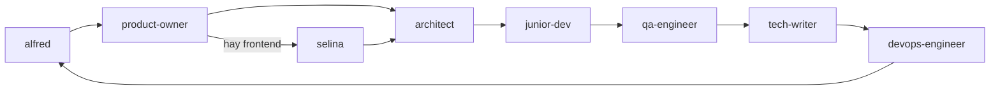

# Alfred Dev for VS Code

> **Este proyecto es un port y no existiría sin el trabajo original de [alfred-dev](https://github.com/686f6c61/alfred-dev)**, el plugin de ingeniería de software para Claude Code creado por **[686f6c61](https://github.com/686f6c61)** ([documentación oficial](https://alfred-dev.com/), licencia MIT). El concepto del equipo de agentes, sus roles y personalidades, los flujos con quality gates y las docs vivas son obra suya. Este repo los adapta a VS Code — todo el mérito del diseño original es del autor.

**Equipo de 12 agentes de ingeniería de software para VS Code.** Orquestación del ciclo de desarrollo con quality gates verificables, TDD estricto, seguridad y compliance europeo (RGPD, NIS2, CRA) integrados desde el diseño. Multi-modelo con política de coste: **Luna para el 80% del trabajo** (junior-dev, escritura, producto), Terra para lo complicado y Sol solo para lo muy complicado. Flujo GitHub nativo: issues desde el PRD, ramas de feature y revisión de PRs como gate de calidad.

Adaptación a los mecanismos nativos de VS Code: custom agents (`.agent.md`), handoffs entre agentes y subagentes.

---

## El equipo

| Agente | Alias | Rol | Modelo (perfil) |
|--------|-------|-----|-----------------|
| `alfred` | Jefe de operaciones | Orquestador: decide qué agente actúa y evalúa gates | Terra → Grok 4.6 → GLM |
| `product-owner` | El Buscador de Problemas | PRDs, historias de usuario, criterios de aceptación | Luna → Grok 4.6 → GLM |
| `selina` | La Estilista | Dirección de estilo visual (solo frontend) | Luna → Grok 4.6 → GLM |
| `architect` | El Dibujante de Cajas | Diseño, ADRs, elección de stack, dependencias | Terra → Grok 4.6 → GLM |
| `junior-dev` | El Aprendiz | **Desarrollador del día a día**: historias, fixes acotados, refactors mecánicos. Escala a senior-dev tras 2 intentos | Luna → Grok 4.6 → GLM |
| `senior-dev` | El Artesano | **MUY complicado**: bugs difíciles, refactors de riesgo, escaladas de junior-dev | Sol → Grok 4.6 → GLM |
| `security-officer` | El Paranoico | OWASP, CVEs, RGPD/NIS2/CRA, threat model, SBOM | Terra → Grok 4.6 → GLM |
| `qa-engineer` | El Rompe-cosas | Code review, test plans, exploratorio, regresión, revisión de PRs | Terra → Grok 4.6 → GLM |
| `tech-writer` | El Escriba | Documentación de código y de proyecto | Luna → Grok 4.6 → GLM |
| `devops-engineer` | El Fontanero | Docker, CI/CD, despliegue, monitoring | Luna → Grok 4.6 → GLM |
| `lucius` | El Director Técnico Externo | Segunda opinión vía Codex CLI (solo lectura) | Luna |
| `seo-specialist` *(opcional)* | El Rastreador | Auditoría SEO, Core Web Vitals, gate de indexación (solo proyectos con web pública) | Luna → Grok 4.6 → GLM |

Tres principios de diseño heredados de alfred-dev:

- **Responsabilidad única.** El Artesano escribe código; El Paranoico audita seguridad. Ninguno invade el territorio del otro.
- **Herramientas restringidas.** No todos los agentes pueden editar ficheros o ejecutar terminal (ver tabla de tools abajo).
- **Quality gates entre fases.** Ningún artefacto pasa de fase sin veredicto: APROBADO, APROBADO CON CONDICIONES o RECHAZADO.

## Instalación

Requisitos: VS Code con GitHub Copilot Chat. Tras instalar, los agentes aparecen en el selector de agente del chat (abajo-izquierda del input) y quedan disponibles **en todos tus proyectos**.

### Opción A: con el instalador (descargando el repo)

```bash
# macOS / Linux
./install.sh

# Windows (PowerShell)
.\install.ps1
```

El instalador muestra un **menú sencillo**. Primero el alcance, luego el paquete:

1. **Instalar a nivel usuario (global)** — perfil de Copilot/VS Code. Tras instalar **puedes cerrar o borrar el repo**: todo queda en tu usuario.
2. **Instalar en un proyecto concreto** — `.github/` de ese repo (viaja con el equipo). Avisa si ya tienes el global (duplicados).
3. **Desinstalar** — global o proyecto (solo retira lo que este instalador puso).

**Qué se copia siempre** (además del paquete de agentes/skills):

| Pieza | Global | Proyecto |
|-------|--------|----------|
| Instructions (reglas globales) | `Code/User/instructions/*.instructions.md` | `.github/instructions/` |
| `AGENTS.md` / `copilot-instructions.md` | No se crea (es del proyecto) | No se crea; plantilla en `alfred-dev/templates/` |
| Templates | `~/.copilot/alfred-dev/templates/` | `.github/alfred-dev/templates/` |

Las skills de proceso también llevan su plantilla en `references/` (viaja con la skill). El agente no necesita el repo del plugin abierto.

**Paquetes** (tras elegir 1 o 2):

| Paquete | Qué instala |
|---------|-------------|
| **Solo agentes** | Los 12 `.agent.md` |
| **Básicas** | Agentes + 8 skills de proceso (`skills/core/`: ADRs, threat-model, SBOM, PRs...) |
| **Completas** | Básicas + 30 skills de stack (`skills/stack/`: Python, WordPress, React, Go...) |

Para instalar en otro ordenador: clona el repo, ejecuta el instalador y elige. El mismo menú sirve para desinstalar.

### Opción B: sin descargar nada (desde GitHub)

1. Paleta de comandos (⇧⌘P) → **`Chat: Install Plugin From Source`**.
2. Introduce la URL del repo: `https://github.com/SrScorpio/alfred-dev-vscode`.
3. Confirma. VS Code clona y registra el plugin él mismo (y gestiona sus updates).

### Opción C: para equipos

Añade el marketplace en los settings del usuario y recomienda el plugin en el workspace:

```json
// settings.json (usuario)
"chat.plugins.marketplaces": ["SrScorpio/alfred-dev-vscode"]
```

```json
// .github/copilot/settings.json (workspace)
{
  "extraKnownMarketplaces": {
    "alfred-dev-vscode": {
      "source": { "source": "github", "repo": "SrScorpio/alfred-dev-vscode" }
    }
  },
  "enabledPlugins": { "alfred-dev-vscode@alfred-dev-vscode": true }
}
```

### Copia manual

Copia los `.agent.md` que quieras a `~/.copilot/agents/` (usuario, todos los
proyectos) o a `.github/agents/` de tu proyecto (solo ese workspace). Evita
tener el plugin instalado y a la vez los ficheros en `.github/agents/` del
mismo repo: saldrían duplicados.

Las instrucciones globales (`instructions/global-instructions.md.instructions.md`) se copian a `.github/instructions/` del proyecto que quieras.

Para las **instrucciones del propio proyecto** (stack, innegociables) copia la plantilla instalada (`~/.copilot/alfred-dev/templates/copilot-instructions.md` o `.github/alfred-dev/templates/`) a la raíz como `AGENTS.md` y rellénala. El instalador **no** crea `AGENTS.md`. Si el proyecto ya tiene `plans/` o `docs/`, esa documentación manda.

## Configuración de modelos

Cada agente declara en su frontmatter un **array `model` priorizado**: VS Code prueba los modelos en orden y usa el primero disponible. Si un proveedor no está instalado, se salta sin errores y cae al siguiente.

Los arrays por defecto asumen estas extensiones de proveedor (instala las que uses):

| Proveedor | Vendor en el picker | Extensión |
|-----------|--------------------|-----------|
| xAI Grok 4.6 | `(xai-grok)` | [Grok for GitHub Copilot Chat](https://marketplace.visualstudio.com/items?itemName=grikomsn.grok-copilot-chat) |
| OpenAI GPT 5.6 (Luna/Sol/Terra) | `(openai-codex)` | [Codex Bridge for Copilot Chat](https://marketplace.visualstudio.com/items?itemName=grikomsn.openai-oauth-copilot-chat) |
| Z.ai GLM | `(glm)` | [GLM Models for GitHub Copilot Chat](https://marketplace.visualstudio.com/items?itemName=yijiazhen-qi.glm-for-github-copilot-chat) |
| GitHub Copilot | `(copilot)` | Incluido con Copilot (fallback garantizado) |

### Bridges instalados en el entorno de desarrollo

Esta es una nota informativa: estos bridges están instalados en el entorno que
mantiene este repositorio, pero no son requisitos del plugin.

| Bridge o proveedor | Uso |
|--------------------|-----|
| [Codex Bridge for Copilot Chat](https://marketplace.visualstudio.com/items?itemName=grikomsn.openai-oauth-copilot-chat) | Catálogo autenticado de modelos Codex de OpenAI mediante ChatGPT OAuth. Registra `(openai-codex)`. |
| [Grok for GitHub Copilot Chat](https://marketplace.visualstudio.com/items?itemName=grikomsn.grok-copilot-chat) | Modelos xAI Grok mediante OAuth. Registra `(xai-grok)`. |
| [GLM Models for GitHub Copilot Chat](https://marketplace.visualstudio.com/items?itemName=yijiazhen-qi.glm-for-github-copilot-chat) | Modelos Z.ai / GLM. Registra `(glm)`. |
| [OpenCode for Copilot Chat](https://marketplace.visualstudio.com/items?itemName=grikomsn.opencode-bridge-copilot-chat) | Modelos OpenCode Zen, Go y Console; sus vendors son `(opencodezen)`, `(opencodego)` y `(opencodeconsole)`. |
| GitHub Copilot LLM Gateway y LM Studio for Copilot Chat | Proveedores locales opcionales; sus modelos no forman parte de las cadenas por defecto. |

**Cómo ver los nombres exactos de tus modelos:** abre el picker de modelos en el chat de Copilot; el nombre cualificado tiene el formato `Nombre del modelo (vendor)`. El catálogo autenticado de Codex Bridge es autoritativo: por ejemplo, la extensión muestra `GPT 5.6 Luna (openai-codex)`, con espacios. Si un nombre del array no coincide con tu instalación, edita el campo `model` del `.agent.md` correspondiente: es una lista YAML y el orden es la prioridad.

Ejemplo de frontmatter de un agente:

```yaml
model: ['GPT 5.6 Terra (openai-codex)', 'GPT-5.6 Terra (copilot)', 'Grok 4.6 (xai-grok)', 'GLM-5.3 (glm)']
```

**Política de modelos GPT-5.6** (prioridad de coste):

- **Luna** (el más barato): máximo posible, para tareas normales → `junior-dev` (el desarrollador del día a día), `product-owner`, `selina`, `tech-writer`, `devops-engineer`, `seo-specialist`, `lucius`.
- **Terra**: tareas complicadas (razonamiento, auditoría) → `alfred`, `architect`, `security-officer`, `qa-engineer`.
- **Sol**: solo tareas muy complicadas → `senior-dev` (reservado a escaladas y bugs difíciles).

**Patrón junior/senior**: `junior-dev` (Luna) implementa por defecto con TDD y escala a `senior-dev` (Sol) tras dos intentos fallidos, código que no entiende o tareas fuera de alcance. Así el coste de desarrollo cotidiano se mantiene en Luna y Sol solo entra cuando de verdad hace falta.

La cadena prioriza tu cuenta de OpenAI (`openai-codex`), cae a las variantes
incluidas con Copilot (`copilot`) si acaso, y después a Grok 4.6 y GLM como
alternativas. Si un nombre no existe en tu catálogo, VS Code lo salta sin
error y usa el siguiente: es una lista YAML, el orden es la prioridad.

### Añadir proveedores adicionales

Para añadir otro proveedor, instala primero una extensión que implemente un
proveedor de modelos para Copilot Chat. Después habilítala en **Manage Models**
y copia el literal exacto del picker. Añádelo siempre al final de la lista
`model`, detrás de los fallbacks existentes.

Claude no está configurado en este repositorio. Si instalas un bridge de
Anthropic compatible, añade sus modelos en este orden como últimos fallbacks:
Opus, Sonnet y Haiku. Conserva el vendor que muestre tu extensión; no inventes
`(anthropic)` ni versiones, porque dependen del bridge y del catálogo de tu
cuenta.

```yaml
# Añade solo nombres que aparezcan en tu selector de modelos.
# model: [..., 'Claude Opus <versión> (<vendor>)',
#             'Claude Sonnet <versión> (<vendor>)',
#             'Claude Haiku <versión> (<vendor>)']
```

Si no quieres cadenas de modelos, borra la línea `model` y el agente usará el modelo que tengas seleccionado en el picker del chat.

## Uso

### Flujos

Arranca hablando con **alfred** (el orquestador). Él enruta al agente adecuado y, al terminar cada fase, los agentes ofrecen **botones de handoff** para pasar al siguiente con el prompt precargado:



- **feature** (completo): producto → estilo visual* → arquitectura+seguridad → desarrollo → calidad+seguridad → documentación → entrega+seguridad.
- **fix** (3 fases): diagnóstico → corrección TDD → validación QA+seguridad.
- **spike**: exploración → conclusiones con ADR.
- **ship** (4 fases): auditoría final → documentación → empaquetado → despliegue (confirmación del usuario siempre).
- **audit**: qa + security + architect + tech-writer en paralelo, informe consolidado.

\* Solo si el proyecto tiene frontend.

Los gates de usuario nunca se autoaprueban: los handoffs usan `send: false` para que tú decidas con un clic cuándo avanzar de fase.

### Flujo GitHub (issues, ramas y PRs)

Si tu proyecto usa GitHub (con `gh` CLI autenticado), el flujo feature se apoya en Issues y Pull Requests **sin necesidad de agentes extra** — cada fase hace su parte:

| Fase | Quién | Qué hace en GitHub |
|---|---|---|
| Producto | `product-owner` | Publica las historias del PRD como issues: una por historia, con criterios Given/When/Then y etiquetas |
| Desarrollo | `junior-dev` / `senior-dev` | Rama `feat/<slug>` por historia, commits atómicos, PR con `Closes #N` al terminar. Nunca commitean a `main` |
| Calidad | `qa-engineer` | Revisa el PR como gate: hallazgos bloqueantes → request-changes; gate superada → approve. CI rojo = rechazado |
| Entrega | `devops-engineer` | CI en cada PR, `main` protegida, releases |

El merge siempre lo decides tú. El contenido de las historias manda el PRD (`docs/prd/`); **el estado del trabajo vive en las issues**, y si no hay `gh` o no hay remoto, el flujo funciona igual en local (commits + gates).

### Memoria y continuidad (dónde vive el estado)

El trabajo nunca depende de una sola persona ni de un chat que se pierde. El estado tiene dos capas, por orden de prioridad:

1. **GitHub Issues + PRs — fuente de verdad colaborativa.** Cada historia es una issue con label de estado; cada gate pasa dejando comentario en la issue o PR. Si mañana quien llevaba el flujo no está, cualquiera reconstruye el estado desde el repo: issues abiertas con sus labels + PRs en revisión. Audit de gates incluido.
2. **`docs/project/status.md` — snapshot local (fallback offline).** Flujo, fase, gate pendiente, siguiente acción. Plantilla instalada en `~/.copilot/alfred-dev/templates/status.md` (global) o `.github/alfred-dev/templates/` (proyecto).

**Labels de estado** (los crea `product-owner` la primera vez):

| Label | Significado |
|-------|-------------|
| `story` | Historia publicada desde el PRD |
| `backlog` | Publicada, sin empezar |
| `in-progress` | El equipo está en ella |
| `in-review` | PR abierto esperando gate de QA |
| `blocked` | Bloqueada (con comentario del porqué) |
| (cerrada) | Hecha — el merge con `Closes #N` la cierra |

**Para retomar** tras un corte: habla con `alfred` y dile «retoma». Su protocolo de arranque reconstruye el estado real (issues → PRs → `status.md`) y continúa exactamente donde estaba: fase, gate pendiente y siguiente acción.

### Subagentes

`alfred`, `senior-dev` y `qa-engineer` pueden lanzar subagentes (campo `agents`): por ejemplo, qa-engineer lanza a security-officer en paralelo durante la fase de calidad, o senior-dev lo lanza para auditar una dependencia nueva.

### Herramientas por agente

| Agente | search | edit | terminal | web | agent (subagentes) |
|--------|:-----:|:----:|:--------:|:---:|:------------------:|
| alfred | ✓ | ✓ | ✓ | ✓ | ✓ (los 9) |
| product-owner | ✓ | ✓ | – | ✓ | – |
| selina | ✓ | ✓ | ✓ | – | – |
| architect | ✓ | ✓ | ✓ | ✓ | – |
| senior-dev | ✓ | ✓ | ✓ | – | ✓ (security) |
| junior-dev | ✓ | ✓ | ✓ | – | – |
| security-officer | ✓ | ✓ | ✓ | ✓ | – |
| qa-engineer | ✓ | ✓ | ✓ | – | ✓ (security) |
| tech-writer | ✓ | ✓ | – | – | – |
| devops-engineer | ✓ | ✓ | ✓ | – | – |
| lucius | ✓ | – | ✓ | – | – |
| seo-specialist | ✓ | ✓ | ✓ | – | – |

Restricción deliberada: tech-writer no ejecuta terminal; product-owner no ejecuta comandos; lucius solo busca y ejecuta Codex CLI en read-only.

### Lucius (segunda opinión externa)

Requiere Codex CLI de OpenAI: `npm install -g @openai/codex` y `codex login`. Lucius audita en sandbox de solo lectura y verifica con Git que no ha tocado nada.

### Artefactos que produce el equipo en tu proyecto

- `docs/prd/` — PRDs (product-owner)
- `docs/adr/` — ADRs numerados (architect)
- `docs/style-direction.md` — dirección visual (selina)
- `docs/test/` — planes de testing (qa-engineer)
- `docs/project/` — arquitectura viva, threat-model, compliance, dependencies, sbom (architect, security-officer)
- `.style-options/` — propuestas visuales temporales (selina, se limpia al elegir)

## Estructura del repo

```
alfred-dev-vscode/
├── plugin.json                # Manifest del plugin (formato Copilot)
├── agents/                    # Los 12 custom agents de VS Code
│   ├── alfred.agent.md
│   ├── product-owner.agent.md
│   ├── selina.agent.md
│   ├── architect.agent.md
│   ├── junior-dev.agent.md
│   ├── senior-dev.agent.md
│   ├── security-officer.agent.md
│   ├── qa-engineer.agent.md
│   ├── tech-writer.agent.md
│   ├── devops-engineer.agent.md
│   ├── seo-specialist.agent.md
│   └── lucius.agent.md
├── templates/                  # Se copian al instalar (no hace falta el repo abierto)
│   ├── adr.md
│   ├── threat-model.md
│   ├── compliance.md
│   ├── sbom.md
│   ├── status.md
│   └── copilot-instructions.md # Plantilla de AGENTS.md (no se crea sola)
├── skills/
│   ├── README.md               # Catálogo: básicas vs completas
│   ├── core/                   # 8 skills de proceso adaptadas a VS Code
│   ├── source-claude/          # memory / style-direction / sonarqube (no se instalan)
│   └── stack/                  # 30 skills de stack MIT (lenguajes/frameworks)
├── instructions/
│   └── global-instructions.md.instructions.md   # El instalador la pone en User/instructions o .github/instructions/
├── install.sh                 # Instalador macOS/Linux
├── install.ps1                # Instalador Windows
├── CHANGELOG.md
└── LICENSE                    # MIT
```

> Alternativa sin plugin: si prefieres no usar el sistema de plugins, copia los
> `.agent.md` que quieras a `.github/agents/` de tu proyecto o a
> `~/.copilot/agents/` (usuario). Evita tener el plugin instalado y a la vez
> los ficheros en `.github/agents/` del mismo repo: saldrían duplicados.

## Roadmap

- [x] **Fase 1** — Los 11 agentes con multi-modelo, handoffs y subagentes (junior/senior incluido).
- [x] **Fase 2** — Flujo GitHub: issues desde las historias del PRD, ramas de feature, PRs y revisión como gate de calidad. Estado del trabajo en issues (labels) + snapshot local `status.md`.
- [x] **Fase 3a** — 8 skills de proceso en `skills/core/`. Archivo Claude (`memory`, `style-direction`, `sonarqube`) solo en `skills/source-claude/`, no se instala.
- [ ] **Fase 3b** — Memoria MCP / companion visual / SonarQube si algún día hay equivalente nativo. Hooks de seguridad.
- [ ] **Fase 4** — Extensión VSIX con UI de configuración de modelos y bootstrap.
- [ ] **Fase 5** — Integración con Ralph Suite (kanban + runner).

## Créditos y licencia

**Basado en [alfred-dev](https://github.com/686f6c61/alfred-dev)** — plugin de ingeniería de software automatizada para Claude Code, creado por **[686f6c61](https://github.com/686f6c61)** bajo licencia MIT. [Documentación completa del proyecto original](https://alfred-dev.com/).

| Viene del trabajo original (todo el crédito a su autor) | Añadido en este port a VS Code |
|---|---|
| Concepto del equipo de agentes y sus 10 roles con personalidad | Adaptación a custom agents de VS Code (`.agent.md`) |
| Flujos feature/fix/spike/ship/audit con quality gates | Handoffs con `send: false` y subagentes |
| Docs vivas (`docs/prd/`, `docs/adr/`, `docs/project/`...) | Arrays `model` multi-proveedor con política de coste |
| Prompts base de los agentes | Agente `junior-dev` (patrón junior/senior) |
| Instrucciones globales base | Agente `seo-specialist` |
| 11 skills de proceso originales | 8 adaptadas a VS Code + 30 skills de stack MIT ([Jeffallan](https://github.com/Jeffallan)) |
| | Flujo GitHub (issues con labels, ramas, PRs) e instaladores con paquetes |

Las instrucciones globales provienen del archivo personal del autor original. Licencia [MIT](LICENSE) — la nota de copyright del autor original se conserva expresamente.
