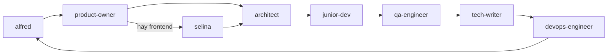

# Alfred Dev for VS Code

**Equipo de 12 agentes de ingeniería de software para VS Code.** Orquestación del ciclo de desarrollo con quality gates verificables, TDD estricto, seguridad y compliance europeo (RGPD, NIS2, CRA) integrados desde el diseño. Multi-modelo con política de coste: **Luna para el 80% del trabajo** (junior-dev, escritura, producto), Terra para lo complicado y Sol solo para lo muy complicado. Flujo GitHub nativo: issues desde el PRD, ramas de feature y revisión de PRs como gate de calidad.

Port del plugin [alfred-dev](https://github.com/686f6c61/alfred-dev) para Claude Code, adaptado a los mecanismos nativos de VS Code: custom agents (`.agent.md`), handoffs entre agentes y subagentes.

---

## El equipo

| Agente | Alias | Rol | Modelo (perfil) |
|--------|-------|-----|-----------------|
| `alfred` | Jefe de operaciones | Orquestador: decide qué agente actúa y evalúa gates | Terra → Grok 4.6 → GLM |
| `product-owner` | El Buscador de Problemas | PRDs, historias de usuario, criterios de aceptación | Luna → Grok 4.6 → GLM |
| `selina` | La Estilista | Dirección de estilo visual (solo frontend) | Luna → Grok 4.6 → GLM |
| `architect` | El Dibujante de Cajas | Diseño, ADRs, elección de stack, dependencias | Terra → Grok 4.6 → GLM |
| `junior-dev` | El Aprendiz | **Desarrollador del día a día**: historias, fixes acotados, refactors mecánicos. Escala a senior-dev tras 2 intentos | Luna → Grok 4.6 → GLM |
| `senior-dev` | El Artesano | **MUY complicado**: bugs difíciles, refactors de riesgo, escaladas de junior-dev | Sol → Grok 4.6 → GLM |
| `security-officer` | El Paranoico | OWASP, CVEs, RGPD/NIS2/CRA, threat model, SBOM | Terra → Grok 4.6 → GLM |
| `qa-engineer` | El Rompe-cosas | Code review, test plans, exploratorio, regresión, revisión de PRs | Terra → Grok 4.6 → GLM |
| `tech-writer` | El Escriba | Documentación de código y de proyecto | Luna → Grok 4.6 → GLM |
| `devops-engineer` | El Fontanero | Docker, CI/CD, despliegue, monitoring | Luna → Grok 4.6 → GLM |
| `lucius` | El Director Técnico Externo | Segunda opinión vía Codex CLI (solo lectura) | Luna |
| `seo-specialist` *(opcional)* | El Rastreador | Auditoría SEO, Core Web Vitals, gate de indexación (solo proyectos con web pública) | Luna → Grok 4.6 → GLM |

Tres principios de diseño heredados de alfred-dev:

- **Responsabilidad única.** El Artesano escribe código; El Paranoico audita seguridad. Ninguno invade el territorio del otro.
- **Herramientas restringidas.** No todos los agentes pueden editar ficheros o ejecutar terminal (ver tabla de tools abajo).
- **Quality gates entre fases.** Ningún artefacto pasa de fase sin veredicto: APROBADO, APROBADO CON CONDICIONES o RECHAZADO.

## Instalación

Requisitos: VS Code con GitHub Copilot Chat. Tras instalar, los agentes aparecen en el selector de agente del chat (abajo-izquierda del input) y quedan disponibles **en todos tus proyectos**.

### Opción A: con el instalador (descargando el repo)

```bash
# macOS / Linux
./install.sh

# Windows (PowerShell)
.\install.ps1
```

El instalador copia los 12 agentes a `~/.copilot/agents/`, la carpeta oficial de
usuario de Copilot. Recarga la ventana de VS Code (`Developer: Reload Window`) y
listo. Para desinstalar: `./install.sh --uninstall` (o `.\install.ps1 -Uninstall`).

### Opción B: sin descargar nada (desde GitHub)

1. Paleta de comandos (⇧⌘P) → **`Chat: Install Plugin From Source`**.
2. Introduce la URL del repo: `https://github.com/SrScorpio/alfred-dev-vscode`.
3. Confirma. VS Code clona y registra el plugin él mismo (y gestiona sus updates).

### Opción C: para equipos

Añade el marketplace en los settings del usuario y recomienda el plugin en el workspace:

```json
// settings.json (usuario)
"chat.plugins.marketplaces": ["SrScorpio/alfred-dev-vscode"]
```

```json
// .github/copilot/settings.json (workspace)
{
  "extraKnownMarketplaces": {
    "alfred-dev-vscode": {
      "source": { "source": "github", "repo": "SrScorpio/alfred-dev-vscode" }
    }
  },
  "enabledPlugins": { "alfred-dev-vscode@alfred-dev-vscode": true }
}
```

### Registro alternativo como plugin local (desarrollo)

Con `./install.sh --plugin` (o `.\install.ps1 -Plugin`) se registra además este
directorio en `chat.pluginLocations` de tu settings, con copia de seguridad:

```json
"chat.pluginLocations": { "/ruta/absoluta/a/alfred-dev-vscode": true }
```

### Copia manual

Copia los `.agent.md` que quieras a `~/.copilot/agents/` (usuario, todos los
proyectos) o a `.github/agents/` de tu proyecto (solo ese workspace). Evita
tener el plugin instalado y a la vez los ficheros en `.github/agents/` del
mismo repo: saldrían duplicados.

Las instrucciones globales (`instructions/global-instructions.md.instructions.md`) se copian a `.github/instructions/` del proyecto que quieras.

## Configuración de modelos

Cada agente declara en su frontmatter un **array `model` priorizado**: VS Code prueba los modelos en orden y usa el primero disponible. Si un proveedor no está instalado, se salta sin errores y cae al siguiente.

Los arrays por defecto asumen estas extensiones de proveedor (instala las que uses):

| Proveedor | Vendor en el picker | Extensión |
|-----------|--------------------|-----------|
| xAI Grok 4.6 | `(xai-grok)` | [Grok for GitHub Copilot Chat](https://marketplace.visualstudio.com/items?itemName=grikomsn.grok-copilot-chat) |
| OpenAI GPT-5.6 (Luna/Sol/Terra) | `(openai-codex)` | [OpenAI OAuth Copilot Chat](https://marketplace.visualstudio.com/items?itemName=grikomsn.openai-oauth-copilot-chat) |
| Z.ai GLM | `(glm)` | [GLM for VS Code Copilot](https://marketplace.visualstudio.com/items?itemName=ikaros.glm-for-vscode-copilot) |
| GitHub Copilot | `(copilot)` | Incluido con Copilot (fallback garantizado) |

**Cómo ver los nombres exactos de tus modelos:** abre el picker de modelos en el chat de Copilot; el nombre cualificado tiene el formato `Nombre del modelo (vendor)`. Si un nombre del array no coincide con el de tu instalación (p. ej. tu catálogo de xAI expone otra versión de Grok), edita el campo `model` del `.agent.md` correspondiente: es una lista YAML, el orden es la prioridad.

Ejemplo de frontmatter de un agente:

```yaml
model: ['GPT-5.6 Terra (openai-codex)', 'GPT-5.6 Terra (copilot)', 'Grok 4.6 (xai-grok)', 'GLM-5.3 (glm)']
```

**Política de modelos GPT-5.6** (prioridad de coste):

- **Luna** (el más barato): máximo posible, para tareas normales → `junior-dev` (el desarrollador del día a día), `product-owner`, `selina`, `tech-writer`, `devops-engineer`, `seo-specialist`, `lucius`.
- **Terra**: tareas complicadas (razonamiento, auditoría) → `alfred`, `architect`, `security-officer`, `qa-engineer`.
- **Sol**: solo tareas muy complicadas → `senior-dev` (reservado a escaladas y bugs difíciles).

**Patrón junior/senior**: `junior-dev` (Luna) implementa por defecto con TDD y escala a `senior-dev` (Sol) tras dos intentos fallidos, código que no entiende o tareas fuera de alcance. Así el coste de desarrollo cotidiano se mantiene en Luna y Sol solo entra cuando de verdad hace falta.

La cadena prioriza tu cuenta de OpenAI (`openai-codex`), cae a las variantes
incluidas con Copilot (`copilot`) si acaso, y después a Grok 4.6 y GLM como
alternativas. Si un nombre no existe en tu catálogo, VS Code lo salta sin
error y usa el siguiente: es una lista YAML, el orden es la prioridad.

Si no quieres cadenas de modelos, borra la línea `model` y el agente usará el modelo que tengas seleccionado en el picker del chat.

## Uso

### Flujos

Arranca hablando con **alfred** (el orquestador). Él enruta al agente adecuado y, al terminar cada fase, los agentes ofrecen **botones de handoff** para pasar al siguiente con el prompt precargado:



- **feature** (completo): producto → estilo visual* → arquitectura+seguridad → desarrollo → calidad+seguridad → documentación → entrega+seguridad.
- **fix** (3 fases): diagnóstico → corrección TDD → validación QA+seguridad.
- **spike**: exploración → conclusiones con ADR.
- **ship** (4 fases): auditoría final → documentación → empaquetado → despliegue (confirmación del usuario siempre).
- **audit**: qa + security + architect + tech-writer en paralelo, informe consolidado.

\* Solo si el proyecto tiene frontend.

Los gates de usuario nunca se autoaprueban: los handoffs usan `send: false` para que tú decidas con un clic cuándo avanzar de fase.

### Flujo GitHub (issues, ramas y PRs)

Si tu proyecto usa GitHub (con `gh` CLI autenticado), el flujo feature se apoya en Issues y Pull Requests **sin necesidad de agentes extra** — cada fase hace su parte:

| Fase | Quién | Qué hace en GitHub |
|---|---|---|
| Producto | `product-owner` | Publica las historias del PRD como issues: una por historia, con criterios Given/When/Then y etiquetas |
| Desarrollo | `junior-dev` / `senior-dev` | Rama `feat/<slug>` por historia, commits atómicos, PR con `Closes #N` al terminar. Nunca commitean a `main` |
| Calidad | `qa-engineer` | Revisa el PR como gate: hallazgos bloqueantes → request-changes; gate superada → approve. CI rojo = rechazado |
| Entrega | `devops-engineer` | CI en cada PR, `main` protegida, releases |

El merge siempre lo decides tú. Las issues son **espejo del PRD** (la fuente de verdad sigue en `docs/prd/`), y si no hay `gh` o no hay remoto, el flujo funciona igual en local.

### Subagentes

`alfred`, `senior-dev` y `qa-engineer` pueden lanzar subagentes (campo `agents`): por ejemplo, qa-engineer lanza a security-officer en paralelo durante la fase de calidad, o senior-dev lo lanza para auditar una dependencia nueva.

### Herramientas por agente

| Agente | search | edit | terminal | web | agent (subagentes) |
|--------|:-----:|:----:|:--------:|:---:|:------------------:|
| alfred | ✓ | ✓ | ✓ | ✓ | ✓ (los 9) |
| product-owner | ✓ | ✓ | – | ✓ | – |
| selina | ✓ | ✓ | ✓ | – | – |
| architect | ✓ | ✓ | ✓ | ✓ | – |
| senior-dev | ✓ | ✓ | ✓ | – | ✓ (security) |
| junior-dev | ✓ | ✓ | ✓ | – | – |
| security-officer | ✓ | ✓ | ✓ | ✓ | – |
| qa-engineer | ✓ | ✓ | ✓ | – | ✓ (security) |
| tech-writer | ✓ | ✓ | – | – | – |
| devops-engineer | ✓ | ✓ | ✓ | – | – |
| lucius | ✓ | – | ✓ | – | – |
| seo-specialist | ✓ | ✓ | ✓ | – | – |

Restricción deliberada: tech-writer no ejecuta terminal; product-owner no ejecuta comandos; lucius solo busca y ejecuta Codex CLI en read-only.

### Lucius (segunda opinión externa)

Requiere Codex CLI de OpenAI: `npm install -g @openai/codex` y `codex login`. Lucius audita en sandbox de solo lectura y verifica con Git que no ha tocado nada.

### Artefactos que produce el equipo en tu proyecto

- `docs/prd/` — PRDs (product-owner)
- `docs/adr/` — ADRs numerados (architect)
- `docs/style-direction.md` — dirección visual (selina)
- `docs/test/` — planes de testing (qa-engineer)
- `docs/project/` — arquitectura viva, threat-model, compliance, dependencies, sbom (architect, security-officer)
- `.style-options/` — propuestas visuales temporales (selina, se limpia al elegir)

## Estructura del repo

```
alfred-dev-vscode/
├── plugin.json                # Manifest del plugin (formato Copilot)
├── agents/                    # Los 12 custom agents de VS Code
│   ├── alfred.agent.md
│   ├── product-owner.agent.md
│   ├── selina.agent.md
│   ├── architect.agent.md
│   ├── junior-dev.agent.md
│   ├── senior-dev.agent.md
│   ├── security-officer.agent.md
│   ├── qa-engineer.agent.md
│   ├── tech-writer.agent.md
│   ├── devops-engineer.agent.md
│   ├── seo-specialist.agent.md
│   └── lucius.agent.md
├── instructions/
│   └── global-instructions.md.instructions.md   # Copiar a .github/instructions/ del workspace
├── install.sh                 # Instalador macOS/Linux
├── install.ps1                # Instalador Windows
├── CHANGELOG.md
└── LICENSE                    # MIT
```

> Alternativa sin plugin: si prefieres no usar el sistema de plugins, copia los
> `.agent.md` que quieras a `.github/agents/` de tu proyecto o a
> `~/.copilot/agents/` (usuario). Evita tener el plugin instalado y a la vez
> los ficheros en `.github/agents/` del mismo repo: saldrían duplicados.

## Roadmap

- [x] **Fase 1** — Los 11 agentes con multi-modelo, handoffs y subagentes (junior/senior incluido).
- [x] **Fase 2** — Flujo GitHub: issues desde las historias del PRD, ramas de feature, PRs y revisión como gate de calidad.
- [ ] **Fase 3** — Skills de proceso (threat-model, write-adr, sbom-generate...), memoria MCP, hooks de seguridad.
- [ ] **Fase 4** — Extensión VSIX con UI de configuración de modelos y bootstrap.
- [ ] **Fase 5** — Integración con Ralph Suite (kanban + runner).

## Créditos y licencia

Port de [alfred-dev](https://github.com/686f6c61/alfred-dev) (MIT). Las instrucciones globales provienen del archivo personal del autor. Licencia [MIT](LICENSE).
