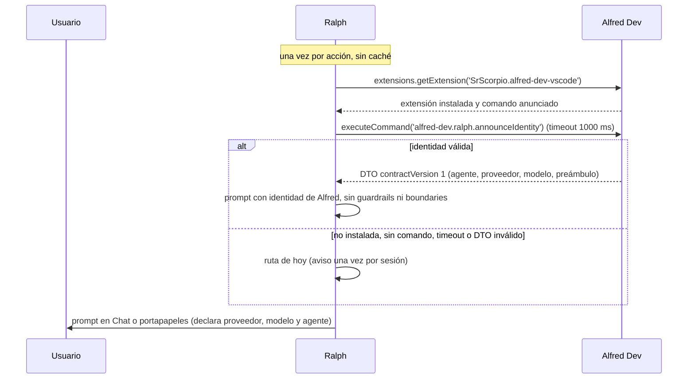

# ADR-003: Identidad de Alfred anunciada a Ralph — subagente por acción

**Project:** Project
**Fecha:** 2026-10-03
**Estado:** aceptado

> Corrección 2026-10-03, tras la decisión del usuario. El DTO **no anuncia proveedor ni modelo**. Cada `agents/<id>.agent.md` ya trae su cadena `model`, y el chat de Copilot elige el primero que exista cuando Ralph menciona a ese subagente. Anunciar un modelo aquí sería un segundo dueño y pisaría esa cadena. El selector `alfred-dev.chatModel` tampoco entra en este DTO.

**Autor:** architect
**Feature:** `alfred-mode`
**Relacionado:** [ADR-018 de `SrScorpio/ralph-suite`](https://github.com/SrScorpio/ralph-suite) (detección del modo, silenciado y propiedad de `AGENTS.md`). ADR-001 (índice de agentes en la raíz) y ADR-002 (carpeta de workspace en multi-root) de este repo.

## Contexto

Hoy Alfred **consume** a Ralph (`RalphBridge`, `RALPH_SUITE_EXTENSION_ID`, `RALPH_COMMAND_BY_CONTEXT`, `resolveRalphSuiteExtension` en `src/integrations/ralph.ts`) y el contrato solo va en una dirección. El PRD de convivencia (`alfred-mode`) añade el otro sentido: en modo Alfred, Ralph construye el prompt con la identidad de Alfred. La detección, el ajuste `ralph-suite.alfredMode` y qué se silencia son decisión de Ralph y viven en su ADR-018. **Alfred no decide nada de eso.** Lo que este ADR fija es exclusivamente lo que Alfred posee: **qué identidad anuncia, con qué forma, y quién manda sobre `AGENTS.md`.**

Hechos del repo que condicionan la decisión:

- El mapa acción → agente **no se inventa**: los 12 agentes ya están declarados en `agents/*.agent.md`, cada uno con su `description`, su lista `model` y sus `handoffs`. Cualquier tabla nueva en un comando sería una segunda fuente de verdad que diverge en la primera release.
- `alfred-dev.modelProfile` (`luna`/`terra`/`sol`) es **preferencia de UI**. `src/commands/modelProfiles.ts` construye elementos de QuickPick y no reescribe el array `model` del frontmatter. La honestidad de esto hay que mantenerla: el perfil de UI no es el modelo que se anuncia.
- La extensión **no empaqueta** los agentes: el `.vsix` de 0.8.1 solo contiene `out/`, `package.json`, `readme.md` y `LICENSE.txt`. Los agentes se instalan por `install.ps1` en `~/.copilot/agents` o en `.github/agents` del proyecto. Por tanto, el anuncio **no puede depender de leer ficheros del perfil de usuario**, y el frontmatter no es legible desde la extensión de forma portable.
- Consecuencia directa: el mapa acción → agente viaja **compilado en `out/`**, junto a los identificadores de comando que la extensión ya declara en `package.json`.
- El fallo ya ocurrió una vez: el `AGENTS.md` de este repositorio está commiteado con cabecera «Generated: 2026-10-03 by Ralph Suite», rol `Senior Software Engineer` y reglas de `plan/`. Un solo dueño no es una preferencia estética, es la reparación de un incidente.

## Opciones consideradas

### Opción A: comando de identidad con mapa incrustado

Alfred contribuye un comando que devuelve un DTO compacto y versionado, con el mapa acción → agente, proveedor y modelo compilado en `out/`. Ralph lo llama una vez por acción y lo valida.

**Ventajas:**

- Contrato explícito, versionado y testeable con el estilo que ya usa `tests/ralph.test.js`.
- Sin lectura de ficheros del usuario: no depende de dónde se instalaron los agentes.
- Una llamada por acción: coste despreciable y sin estado que se quede obsoleto.

**Inconvenientes:**

- El mapa vive en código; cambiar el agente por defecto de una acción exige publicar versión de Alfred.
- Si el mapa y el frontmatter de `agents/*.agent.md` se desincronizan, el anuncio miente. Mitigación: el mapa es corto, estable y con test propio.

### Opción B: Alfred escribe la identidad en un fichero del workspace

`AGENTS.md` ampliado, o un `.ralph/alfred-identity.json`, o `package.json` de Alfred.

**Ventajas:**

- No hay comando entre extensiones.

**Inconvenientes:**

- Escribe en el runtime de Ralph o en un fichero que Ralph tendría que aprender a parsear: acoplamiento por disco y una segunda fuente de verdad.
- `AGENTS.md` es el manual de los agentes, no un fichero de configuración. Meter DTOs ahí convierte el manual en un contrato oculto.
- Si Alfred no está activo, el fichero queda obsoleto y falla en silencio.

### Opción C: no anunciar nada; que Ralph copie su tabla

Ralph mantendría su propio mapa acción → agente de Alfred.

**Ventajas:**

- Cero cambios en Alfred.

**Inconvenientes:**

- Dos fuentes de verdad para la misma identidad. El día que Alfred renombre un agente o cambie su modelo base, Ralph seguirá anunciando el viejo con seguridad.
- Es exactamente el dolor del PRD (Ralph imponiendo identidad) con otro nombre.

### Opción D: que Alfred empuje la identidad al activarse

Alfred llamaría un comando de Ralph al arrancar para «entregarle» su identidad.

**Ventajas:**

- El modo Alfred podría activarse sin que Ralph sondee.

**Inconvenientes:**

- Invoca la dirección contraria a la que decide P1 (Ralph es dueño de la detección) y crea dependencia del orden de activación.
- Alfred necesitaría conocer el modo de Ralph, que no es suyo.

## Decisión

Se elige la **Opción A**.

### 1. Nombre y forma del anuncio

- **Comando (nuevo):** `alfred-dev.ralph.announceIdentity`. Es el único identificador nuevo de este ADR y el que Ralph comprueba para saber si Alfred es compatible.
- **Nada más cruza en este sentido.** Ningún fichero, ningún ajuste, ninguna escritura.

### 2. Contrato de identidad (v1)

```text
{
  contractVersion: 1,
  agentsMdOwner: 'alfred-dev',
  actions: {
    runTask:        { agent, mention, provider, model, preamble },
    optimizeMemory: { … },
    analyzeProject: { … },
    initProject:    { … },
    syncIssue:      { … }
  }
}
```

- `actions` cubre **las cinco acciones** que pueden lanzar un agente: `runTask`, `optimizeMemory`, `analyzeProject`, `initProject`, `syncIssue`. Una acción nueva se añade aquí y en el `switch` de Ralph; no hay lógica oculta.
- `provider`: vocabulario que Ralph ya usa (`copilot | codex | claude | opencode`). Se declara explícitamente porque `executeCommand` cae en el proveedor por defecto del host.
- `model`: **propuesta, no forzado.** Ralph recomienda, igual que hoy (ADR-017 de Ralph); no existe API estable para forzar el modelo del chat.
- `null` significa «default del proveedor» declarado de forma explícita. **`''` está prohibido:** un prompt con modelo vacío implícito es exactamente lo que HU-4 quiere cerrar.
- `preamble`: una línea ≤ 200 caracteres, sin caracteres de control, sin `plans/` ni `/plan/`.
- `mention`: `@` + el identificador del agente, para que el prompt lo invoque de forma inequívoca.

### 3. Mapa acción → agente (v1) y su relación con el frontmatter

| Acción de Ralph | Agente anunciado |
|---|---|
| `runTask` | `junior-dev` (tareas del backlog bien definidas; el flujo de Alfred escala a `senior-dev` internamente) |
| `optimizeMemory` | `tech-writer` |
| `analyzeProject` | `product-owner` |
| `initProject` | `alfred` |
| `syncIssue` | `alfred` |

**De dónde salen proveedor y modelo:** de la **primera entrada** del array `model` del agente en `agents/*.agent.md`, que es el orden de preferencia que ya declara el frontmatter. Hoy eso da `junior-dev` y `tech-writer` → `openai-codex` / «GPT 5.6 Luna»; `product-owner` → `openai-codex` / «GPT 5.6 Luna»; `alfred` → `openai-codex` / «GPT 5.6 Luna». El orden de esta lista en los ficheros de agente es, por tanto, parte del contrato: reordenarlo cambia lo que Ralph anuncia.

**Relación con el perfil de UI:** `alfred-dev.modelProfile` sigue siendo preferencia visual y no interviene (ADR-017 de Ralph ya descartó proyectar `luna`/`terra`/`sol` sobre `engine`/`model`). Este ADR lo documenta como decisión, no como nota al pie: el perfil elige qué se muestra y con qué coste se conversa; el anuncio declara qué proveedor y modelo se recomiendan para una acción concreta. Son ejes distintos y no se mezclan.

### 4. Alineación con el frontmatter

El DTO se compila a partir de una **constante única** en `src/commands/identity.ts`, y un test (`tests/identity.test.js`) comprueba, contra los ficheros de `agents/`, que:

- cada agente del mapa existe en `agents/`;
- el proveedor y el modelo anunciados coinciden con la primera entrada del `model` del agente;
- ninguna `preamble` contiene `plans/` ni `/plan/`;
- el DTO valida su propia forma (versión, cinco acciones, campos no vacíos).

El mapa no es «código que copia el frontmatter»: es una tabla corta con un test que la ata al frontmatter. Si dentro de un año se añade un agente nuevo, el test seguirá verde; si se cambia el modelo base de `junior-dev`, el test falla y obliga a decidir.

### 5. `AGENTS.md`: dueño único, y el modo Alfred es la barrera

- `AGENTS.md` es **el índice de agentes de Alfred** (ADR-001). En modo Alfred, **Ralph no escribe ni regenera** ninguno de los siete ficheros de su `setupProject`; la detección y el silenciado son decisión y código de Ralph (ADR-018). Aquí solo se fija la propiedad y el contenido del aviso: dueño = `SrScorpio.alfred-dev-vscode`.
- En modo desactivado, `setupProject` de Ralph vuelve a escribir y puede volver a pisar el fichero. El modo Alfred es la barrera mientras está activo; **HU-8 del PRD sigue pendiente** y no se resuelve con este ADR (ver «Trabajo no cerrado por este ADR»).
- Alfred **no** pierde su propio camino de generación: actualizar el índice de agentes es de Alfred. Lo que este ADR prohíbe es que la regeneración la dispare el botón de Ralph (P2: el botón sigue visible pero bloqueado).

### 6. Qué NO decide este ADR

- El **ajuste** `ralph-suite.alfredMode`, su nombre, sus valores y su lectura: ADR-018.
- **Qué se silencia** (guardrails, boundaries, agentRole, agentStack, agentProject, perfiles de modelo): ADR-018.
- La **detección** (id de extensión más comando anunciado): ADR-018.
- El **aviso de overrides** con `/plan/` y la política de no escribir `settings.json` (P3): ADR-018.
- **HU-5** (Proyecto vs Workspace, proyecto por tarjeta) y **HU-6** (fuera `plans/`): comportamiento de Ralph, sin decisión arquitectónica de Alfred.

## Diagrama de secuencia



**Leyenda:** la única flecha que cruza es `announceIdentity`, de lectura. No hay ficheros compartidos, ni ajustes escritos, ni estado cacheado entre extensiones.

## Contrato entre las dos extensiones

### Lo que Alfred anuncia

| Campo | Tipo | Notas |
|---|---|---|
| `contractVersion` | number | Versión soportada: `1` |
| `agentsMdOwner` | string | `alfred-dev` |
| `actions[].agent` | string | Identificador del agente de Alfred |
| `actions[].mention` | string | `@` + agente |
| `actions[].provider` | string | `copilot \| codex \| claude \| opencode` |
| `actions[].model` | string \| null | Cadena no vacía, o `null` = «default del proveedor» |
| `actions[].preamble` | string | Una línea, ≤ 200 caracteres, saneada |

### Lo que Ralph lee

Exactamente eso, y nada más. Ralph **no** lee `alfred-dev.modelProfile`, ni el frontmatter de `agents/`, ni `AGENTS.md` para construir el prompt.

### Lo que no cruza

- Ficheros: ni en un sentido ni en otro. `.ralph/` y `docs/project/` no se comparten.
- Ajustes: ni Alfred escribe `ralph-suite.*`, ni Ralph escribe `alfred-dev.*`.
- Perfiles de modelo: `luna`/`terra`/`sol` no se proyectan sobre `engine`/`model`.
- Backlog y estados: siguen como hoy (ADR-002 de este repo); este ADR no cambia `runTask` ni `syncIssue`.
- Paralelismo y scheduler: ADR-016 de Ralph, sin cambios.

## Estrategia de errores

- **Alfred no instalado, sin el comando o inactivo:** Ralph no llama a nada; el modo no se activa. Alfred no sabe ni necesita saber que fue sondeada.
- **Timeout (1000 ms) o excepción al ejecutar el comando:** Ralph cae a la ruta de hoy y avisa una vez por sesión. Alfred no registra nada por su parte y sigue siendo usable de forma independiente.
- **DTO inválido:** la validación estricta es de Ralph (fail-closed, todo el modo o nada). Alfred, en su lado, garantiza la forma con un test propio: es un fallo de implementación de Alfred, no una condición de entorno.
- **El mapa y el frontmatter divergen:** falla el test de identidad en CI. Un mapa silenciosamente desincronizado sería peor que no anunciar nada.
- **`setupProject` en modo Alfred:** no escribe. El aviso y el bloqueo del botón son de Ralph (P2); Alfred solo es el nombre que aparece como dueño.

## Criterios de aceptación

- `alfred-dev.ralph.announceIdentity` está contribuido en `package.json` y devuelve el DTO v1.
- El DTO cubre las cinco acciones y declara proveedor, modelo (o `null`) y agente en todas.
- Ninguna `preamble` contiene `plans/`, `/plan/` ni caracteres de control.
- `tests/identity.test.js` valida la forma del DTO y su coherencia con `agents/*.agent.md` (existencia del agente, proveedor y modelo = primera entrada del `model`).
- `tests/ralph.test.js` sigue verificando que el puente no rompe nada de lo existente y que, en ausencia de Ralph, Alfred funciona igual.
- El DTO no contiene rutas absolutas, rutas de perfil de usuario ni datos del entorno: es portable y reproducible.
- La documentación (`docs/ralph/integracion.md`) refleja que el contrato pasa a ser bidireccional: `announceIdentity` hacia Ralph, y el resto igual.

## Consecuencias

### Positivas

- Una sola fuente de verdad de la identidad: Alfred. Ralph consume, no reinterpreta.
- El contrato es versionado, pequeño y testeable, con el estilo de los tests que ya existen.
- `alfred-dev.modelProfile` queda documentado como lo que es (preferencia de UI) y deja de ser un malentendido recurrente.
- Alfred no depende de Ralph para funcionar: sin Ralph, cero cambios.

### Negativas

- El mapa vive en código: cambiar el agente por defecto de una acción exige publicar Alfred. Es el precio de no leer los ficheros de agente, que no están empaquetados en el `.vsix`.
- El orden de la lista `model` de cada agente pasa a ser contrato de facto. Mitigado con test, pero es acoplamiento real entre documentación y código.
- Superficie nueva de un comando que expone cadenas que acaban dentro de un prompt. Mitigada con whitelist, saneado y tope de longitud; **pendiente de veredicto del security-officer**.
- Mientras HU-8 no se cierre, el `AGENTS.md` envenenado de este repo sigue ahí: el ADR documenta la barrera, no la reparación.

## Trabajo no cerrado por este ADR

- **HU-8** — reclamar y regenerar el `AGENTS.md` de este repo (cabecera de Ralph Suite, rol y reglas de `plan/`). Lo produce el equipo de Alfred; no requiere este ADR.
- **HU-3** — el bloqueo real de `setupProject` es código de Ralph (ADR-018).
- **Versión/publicación** — sin cambio de versión ni publicación en esta feature (PRD §3). El `announceIdentity` existirá en las ramas WIP, no en el `.vsix` 0.8.1.

## Referencias

- `src/integrations/ralph.ts`: `RALPH_SUITE_EXTENSION_ID`, `RALPH_COMMAND_BY_CONTEXT`, `resolveRalphSuiteExtension`, `RalphBridge`.
- `src/commands/index.ts`: registro de los comandos `alfred-dev.ralph.*`.
- `src/commands/modelProfiles.ts`: `MODEL_PROFILES`, y la nota de que no reescribe el frontmatter.
- `agents/*.agent.md`: `description`, `model`, `handoffs`.
- `install.ps1`, `plugin.json`: instalación de agentes fuera del `.vsix`.
- `docs/ralph/integracion.md`: matriz de contrato actual.
- `tests/ralph.test.js`, `tests/model-profile.test.js`, `tests/package-contract.test.js`.
- ADR-001 y ADR-002 (este repo). ADR-016 y ADR-018 de `SrScorpio/ralph-suite`.
