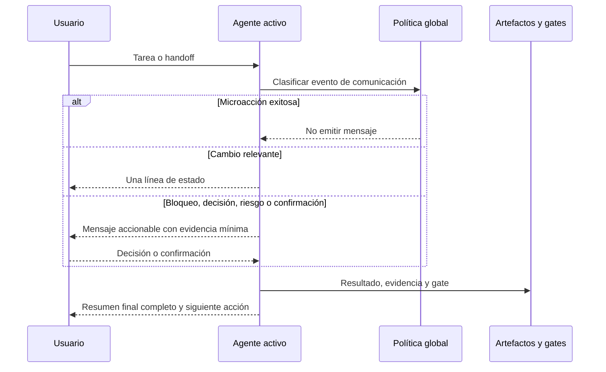

# Arquitectura: mensajes de chat muy compactos

**Estado:** Aceptado. Implementado en `5cdb5a1`.

**Alcance:** Aplicar el PRD `docs/prd/compact-chat-progress.md` a las instrucciones y agentes de Alfred Dev. No cambia el runtime de la extensión VSIX, los modelos, los handoffs ni las quality gates.

## Decisiones

- [ADR-001: Política global de progreso compacto](../adr/ADR-001-politica-global-de-progreso-compacto.md)
- [ADR-002: Excepciones obligatorias de comunicación](../adr/ADR-002-excepciones-obligatorias-de-comunicacion.md)
- [Evaluación de dependencias](dependencies.md): ninguna dependencia nueva.

## Componentes

| Componente | Responsabilidad única | Entrada | Salida |
|------------|----------------------|---------|--------|
| Usuario | Solicitar trabajo y tomar decisiones o confirmaciones | Petición, respuesta, aprobación | Decisión explícita |
| Instrucción global | Definir cuándo un mensaje de progreso es admisible | Evento de trabajo | Regla de progreso compacto |
| Agente activo | Ejecutar su responsabilidad siguiendo la política común | Contexto, tarea, instrucciones | Resultado, bloqueo o gate |
| Adaptador Alfred | Consolidar estado de flujo, gates y siguiente handoff | Resultados de agentes e issues/PRs | Estado compacto y veredicto |
| Adaptador QA | Acumular notas exploratorias y emitir un único informe | Evidencia de pruebas | Hallazgos y veredicto |
| Adaptador Lucius | Solicitar confirmación costosa y preservar evidencia Git | Scope, confirmación, resultado Codex CLI | Informe o anomalía de integridad |
| Artefactos persistidos | Conservar PRD, ADRs, estado y evidencia de gates | Decisiones y resultados | Trazabilidad auditable |

## Diagrama de componentes

```mermaid
flowchart TD
	U[Usuario] -->|tarea o decisión| A[Agente activo]
	G[Instrucción global\npolítica de progreso compacto] --> A
	A -->|handoff y resultado| O[Alfred\norquestación y gates]
	O -->|siguiente agente| A
	A -->|evidencia o gate| P[Artefactos persistidos\nPRD, ADRs, issues, status]
	A -->|bloqueo, decisión, riesgo\no resultado final| U
	Q[QA\nnotas acumuladas e informe] --> O
	L[Lucius\nconfirmación e integridad Git] --> O
	G --> Q
	G --> L

	classDef policy fill:#e8f1ff,stroke:#2563eb,color:#111827
	classDef agent fill:#ecfdf5,stroke:#059669,color:#111827
	classDef evidence fill:#fff7ed,stroke:#ea580c,color:#111827
	class G policy
	class A,O,Q,L agent
	class P evidence
```

**Leyenda:** flecha continua = contexto, control o resultado; azul = política compartida; verde = ejecución por agentes; naranja = evidencia persistida.

## Flujo de datos

**Leyenda:** las microacciones incluyen búsquedas, lecturas, comandos y comprobaciones internas sin incidencia. Los informes finales no se reducen: se consolidan al cierre.

## Contratos

### Evento de comunicación

| Tipo | Emisión | Contenido mínimo | Límite |
|------|----------|------------------|--------|
| Microacción exitosa | Nunca | N/A | Silencioso |
| Cambio relevante | Opcional | Estado y siguiente acción | Una línea |
| Bloqueo o decisión | Obligatoria e inmediata | Impacto y decisión requerida | Una pregunta clara |
| Riesgo, operación sensible o divergencia | Obligatoria e inmediata | Riesgo, evidencia y acción segura | Sin continuar sin confirmación cuando aplique |
| Gate o resultado final | Obligatoria | Formato del rol, evidencia y siguiente acción | Detalle requerido por el rol |

### Handoff

| Campo | Regla |
|-------|-------|
| Contexto | Referenciar el artefacto y el estado actual; no repetir historial conocido. |
| Tarea | Una responsabilidad concreta y sus criterios de aceptación. |
| Bloqueo previo | Transferirlo explícitamente si existe. |
| Modelo | Lo resuelve el agente receptor con su propia cadena `model`. |

## Estrategia de errores y seguridad

- Un fallo de lectura, comando o integración solo se comunica si bloquea, cambia el resultado o requiere una decisión.
- Los bloqueos, riesgos de seguridad, pérdidas potenciales de datos y divergencias de integridad siempre interrumpen el silencio.
- Lucius mantiene confirmación explícita antes de invocar Codex CLI y compara el estado Git antes y después; esas garantías no se compactan.
- QA acumula la evidencia de exploración y publica el informe consolidado al cierre; un hallazgo bloqueante se comunica de inmediato.
- Alfred conserva el formato de veredicto y solo publica el estado de flujo cuando cambia la fase, la gate o la acción requerida.

## Escalabilidad

El coste de la política es $O(1)$ por evento conversacional: clasificarlo como microacción, cambio relevante, excepción o cierre. No añade red, almacenamiento, procesos ni dependencias. Con $10 \times$ más agentes o handoffs, la fuente única evita multiplicar reglas; el riesgo operativo es la divergencia de instrucciones locales, mitigada por la revisión de QA sobre escenarios representativos.

## Trazabilidad del PRD

| Requisitos | Componente o decisión | Validación prevista |
|------------|------------------------|---------------------|
| AC1, AC2, AC9 | Instrucción global | Pruebas de conversaciones cortas y largas sin mensajes de microacciones |
| AC3, AC8 | Adaptador Alfred y contrato de handoff | Handoff entre dos agentes sin repetición de contexto |
| AC4, AC5, AC10 | Excepciones obligatorias, ADR-002 | Escenarios de bloqueo, riesgo, confirmación y divergencia |
| AC6, AC7 | Adaptadores Alfred, QA y Lucius | Verificar informe final, veredicto y evidencia de gate |
| Métricas de reducción | QA | Comparación de tareas representativas antes y después |

## Límites de implementación

- Modificar primero `instructions/global-instructions.md.instructions.md`: será la fuente única de política.
- Ajustar solo reglas locales que contradigan la política: Alfred, QA y Lucius.
- Los demás agentes no reciben una política duplicada; sus anuncios de activación se harán compactos por la instrucción global.
- No añadir telemetría, filtros de runtime, paquetes ni servicios externos.

## Estado de implementación

Publicado en `5cdb5a1`. Contrato: `tests/compact-chat-progress.test.js`. Sin dependencias nuevas. Compilación TypeScript no ejecutada en el entorno de entrega (falta `node_modules`).
